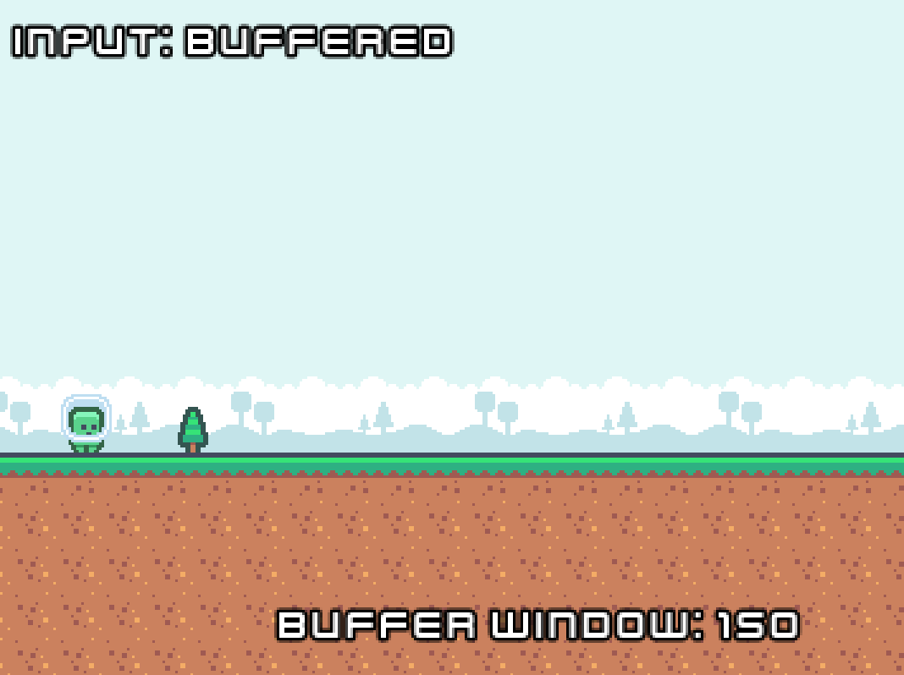

# Godot Buffered Input

##### More responsive input in Godot

Ever had a game ignore your input because you pressed the button a millisecond too early? This project fixes that problem by implementing an input buffer, which stores inputs for a short window of time so their associated actions can be executed in the next possible frame. It's easy to add it to any project, supports keyboard and controller input, and works with both GDScript and C#. Your players won't know it's there, but they'll feel it!

Give our [demo](https://btaylor.itch.io/buffered-input-for-godot) a try on Itch.io!

## Usage

### C#
1. Place a copy of the `BufferedInput.cs` file into your project.  Getting a copy of this file is easy, just clone the repository, download a release from Github or download a release from Itch.io.  Once you have a copy, move it wherever makes the most sense in your project folder.
2. Add the `BufferedInput.cs` file to your project's AutoLoad settings.  More information on AutoLoad scripts can be found [here](https://docs.godotengine.org/en/stable/tutorials/scripting/singletons_autoload.html).
3. That's all the setup that's necessary.  To use it, just call `BufferedInput.IsActionJustPressed` where you'd usually call `Input.IsActionJustPressed`.

### GDScript

1. Put a copy of the `buffered_input.gd` file into your project. Getting a copy of this file is easy, just clone the repository, download a release from Github or download a release from Itch.io.  Once you have a copy, move it wherever makes the most sense in your project folder.
2. Add the `buffered_input.gd` script to your project's AutoLoad settings. More information on AutoLoad scripts can be found [here](https://docs.godotengine.org/en/stable/tutorials/scripting/singletons_autoload.html).
3. That's all the setup you need! To use it in your game, just call `BufferedInput.is_action_just_pressed` where you'd usually call `Input.is_action_just_pressed`

## Special Thanks

 - Special thanks goes out to [drkitt](https://github.com/drkitt/godot-input-buffer) who wrote this originally for Godot 3.x!  Your work is amazing and I greatly appreciate it.
 - Additionally, special thanks goes out to [johnnyneverwalked](https://github.com/johnnyneverwalked/godot-input-buffer/tree/godot-4) who initially ported this to Godot 4.x!
 - As always, thanks to [kenney_nl](https://www.kenney.nl/)!

# Why the rewrite?

Both drkitt and johnnyneverwalked have done some amazing work and they deserve a whole lot of thanks and recognition.  However, there were a few issues that I felt justified a fork of the project.

- The original example project was never properly updated for Godot 4.
- The C# release for Godot 4.x doesn't currently work on newer versions of Godot such as 4.2.2-stable.
- I feel that not mirroring the Input API was a misstep.  Changing this would break the API for anyone using the original release trying to update should my changes be accepted upstream.
- As written, extending it to support the other various input types would become a maintenance nightmare.